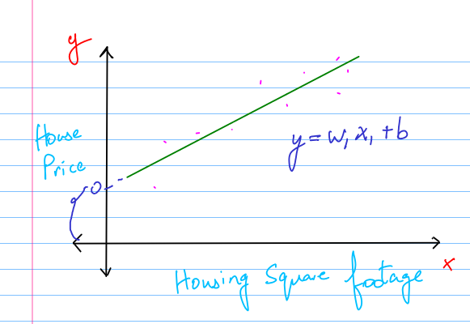
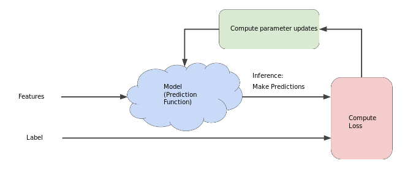
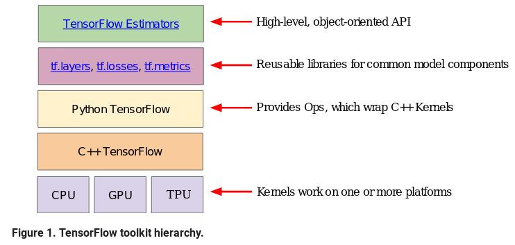

# Tensorflow ML
I needed to learn about tensorflow, so I started about learning about what goes on within Tensorflow. This is the course I started with

## Background Topics 

### Framing?

Basic framework -> Supervised machine learning. 

Label $y$ is what we're trying to predict.
Features are input variables that describe our data $x_i$. 
$$\{ x_1,x_2, ...,x_n\}$$
Example is one piece of data i.e. x

Labelled example -> $\{x,y\}$. We have both, so we use this for training
Unlabelled example -> $\{x,?\}$. We have feature information but not the result

Model is used to map $x$ to $y$. There's model **training or learning** (uses labelled examples) and model inference i.e. applying the model to unlabelled examples.

### [Regression vs Classification](https://developers.google.com/machine-learning/crash-course/framing/ml-terminology)

**Regression** 
A regression model predicts continuous values. For example, regression models make predictions that answer questions like the following:

* What is the value of a house in California?* What is the probability that a user will click on this ad?

**Classification**
A classification model predicts discrete values. For example, classification models make predictions that answer questions like the following:

* Is a given email message spam or not s
pam?
* Is this an image of a dog, a cat, or a hamster?

### Linear Regression

How do we know if the above predicted line is correct or not? We need to think of regression as a problem of minimizing the loss function. 

**Choosing a convenient loss function**

$L_2$ Loss for a given example is also called squared error. 

i.e. Square of distance between prediction and label

= (observation - prediction)$^2$  
= ${(y-y')}^2$

**Defining $L_2$ loss over the entire dataset**

$$L_2Loss = \sum_{{(x,y)}\in D}^{} {(y-prediction(x))^2}$$

Where $\Sigma$ : Summing over the total dataset
$D$ : Sometimes useful to average over all the examples in the dataset , so a divide by $\frac{1}{||D||}$

#### Visualizing Loss function

The left one is the loss function and the right is the regression line.

### Reducing Loss

Choosing model parameters to minimize the loss.

**Hyperparameters** are the configuration settings used to tune how the model is trained. 

How do we minimize the loss or see how the loss changes? 

We take the derivative of the loss function with respect to the weights and biases

For example ${(y-y)}^2$

* Easy to compute and convex

So, we repeatedly take steps in the direction that minimizes loss.

* These steps are called **Gradient Steps** (but they're really negative Gradient steps)
* Thus, this process is called **Gradient Descent**.

**Hyperparameter : Learning rate**
Programmers tweak hyperparameters ( i.e. the knobs for the model/machine) to get the best results. 

For learning rate (i.e. the step size), there are a few issues associated :

* *Learning rate is too small* : The learning would take forever (i.e. it's really slow), but there's high accuracy. 
* *Learning rate is too high* : The loss would overshoot the minimum (not good!).

**There's a Goldilocks learning rate for every regression problem.**

The Goldilocks value is related to how flat the loss function is. If you know the gradient of the loss function is small then you can safely try a larger learning rate, which compensates for the small gradient and results in a larger step size.

For example : 
The ideal learning rate in one-dimension is $\frac{1}{f(x)''s} $
(the inverse of the second derivative of $f(x)$ at $x$).

The ideal learning rate for 2 or more dimensions is the inverse of the Hessian (matrix of second partial derivatives).

The story for general convex functions is more complex.

It's an iterative approach :

Data comes in, we compute the gradient of the loss function. The negative gradient tells us where to move to reduce the loss

**Where to start the weights? Does it matter where we start?**

Do we start with a random initialization/assignment of weights?

Take a step back to Calculus and have a look at -> Convex (converges, i.e. gives a local Minima) vs. Non-convex (doesn't converge) models.

Initialization matters when you're dealing with a Non-convex model.

**Efficiency**
Math suggests that we should iterate over the whole dataset, but for large datasets, to avoid large computations, empirical evidence suggests that small steps are good.

There are two ways :

1. **Stochastic Gradient Descent** : One example at a time.
2. **Mini-batch Stochastic Gradient Descent**: Batches of 10-100. Losses are averaged over a batch.

#### Iterative method walkthrough

The `model` takes one or more features ($x_1,x_2... x_n$) and then computes a prediction($y'$).

To simplify this, lets consider a model that takes one feature and returns one prediction. 

$$y'=b+w_1x_1$$

1. Here, what values do we need to set for $b$ and $w_1$? For linear regression problems, aren't important. We could pick random values, but we start with trivial values.

$b=0$
$w=0$

2. Lets calculate loss (we consider the square loss function). The loss function takes in the 2 parameters :

* $y'$: The model's prediction for features x.
* $y$ : The correct label for the feature.

3. At last, we've reached the `Compute parameter updates` part of the diagram. It is here that the machine learning system examines the value of the loss function and generates new values for $b$ and $w$. For now, just assume that this mysterious box devises new values and then the machine learning system re-evaluates all those features against all those labels, yielding a new value for the loss function, which yields new parameter values. And the learning continues iterating until the algorithm discovers the model parameters with the lowest possible loss. Usually, you iterate until overall loss stops changing or at least changes extremely slowly. When that happens, we say that the model has converged.

> A Machine Learning model is trained by starting with an initial guess for the weights and bias and iteratively adjusting those guesses until learning the weights and bias with the lowest possible loss.

## First steps
Tensorflow $\rightarrow$ A graph-based computational framework

Here's the hierarchy ( Source : Machine Learning Crash Course Google).

Tensorflow uses the following two components : 
* a [graph protocol buffer]

### Graph Protocol Buffer

What is a graph protocol buffer?

To understand that, we must first understand what is a protocol buffer. 