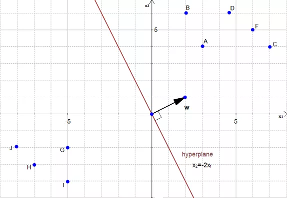
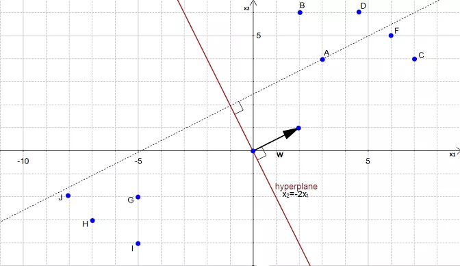

# SVM

> This is my version of [SVM Tutorial website](http://www.svm-tutorial.com/).

## What is SVM ?

> The main goal in SVM is to design a hyperplane that classifies all training vectors in 2 classes.

* **SVM needs training data thus comes under supervised learning**.
* **SVM is a classification algorithm**

**Example** :

* We have plotted the size and weight of several people, and there is also a way to distinguish between men and women.

With such data, using a SVM will allow us to answer the following question:

> Given a particular data point (weight and size), is the person a man or a woman ?

* For instance:  if someone measures 175 cm and weights 80 kg, is it a man of a woman?

## Hyperplane

In geometry, a hyperplane is a **subspace of one dimension less than its ambient space**.

Example :

  * If a space is 3-dimensional then its hyperplanes are the 2-dimensional planes, while

  * If the space is 2-dimensional, its hyperplanes are the 1-dimensional lines.

This notion can be used in any general space in which the concept of the dimension of a subspace is defined.

##  Maximum margin?

Now the following problem exists :

> There can be 'n' number of hyperplanes that can be drawn that separate both our classes.

**But SVM's goal is to get the hyperplane that leaves the maximum margin from both classes ( i.e. the best choice )**

Thus, we arrive at the term : `Maximum Margin Hyperplane`.

<!--  -->
<!-- <figure>
    
    <figcaption><strong>The Optimal HyperPlane is a no man's land.</strong></figcaption>
</figure> -->

**The Optimal HyperPlane is a no man's land.**

* **This means that the optimal hyperplane will be the one with the biggest margin.**

*That is why the objective of the SVM is to find  the optimal separating hyperplane which maximizes the margin of the training data.*

Equation for the hyperplane :
$$g(\vec{x}) = w^T\vec{x}+w_0$$

## How to Calculate this margin?

To do so, we need certain pre-requisites:

> SVM = Support VECTOR Machine

### What is a vector ?

If we define a point $A(3,4)$ in $\Re^2$, we can plot it like this :

> Definition: Any point $x=(x1,x2),x\ne0$, in $\Re^2$,$\Re^2$ specifies a vector in the plane, namely the vector starting at the origin and ending at $x$.

i.e. there is a vector between origin and A.

If we say that the point at the origin is the point $O(0,0)$ then the vector above is the vector $\vec{OA}$. We could also give it an arbitrary name such as **$u$**.

> **Definition**: A vector is an object that has both a magnitude and a direction.

### SVM HyperPlane :

#### Understanding the equation of the hyperplane :
* Equation of a line is $ y= mx +c$
* For Hyperplane, it is defined as :

**$$ w^Tx=0$$**

**How do the 2 forms relate?**
In hyperplane equation, we can see that the name of the variables are in bold which means that they are vectors.

Morover, $w^Tx$ is how we compute the inner product of the 2 vectors a.k.a **dot product**.

Note :
$$y= mx +c$$
is the same thing as
$$y-mx-c=0$$

Given 2 vectors,
$$w=\begin{pmatrix} -c \\ -m \\ 1 \\ \end{pmatrix}$$ and $$ x= \begin{pmatrix} 1 \\ x \\ y \\ \end{pmatrix}$$

Thus, the dot product will be
$$w^Tx=-c\times(1)+ (-m)\times x+1\times y$$
$$w^Tx=y-mx-c$$

The 2 equations are just different ways of expressing the same thing.

Note : $w_0$ is $-c$, which means that this value determines the intersection of the line with the vertical axis.

> We use the hyperplane equation because it is then easy to work in more than 2 dimensions

> The vector **$w$** will always be normal to the hyperplane.

This property will come in handy to compute the distance from a point to the hyperplane.

### Computing the distance :

To simplify this example, we have set $w_0=0$.

In the above figure, the equation of the hyperplane is :
$$x_2=-2x_1$$

Which is equivalent to

$$w^Tx=0$$

with $$w \begin{pmatrix}2 \\ 1 \\ \end{pmatrix}$$
and $$x\begin{pmatrix} x_1 \\ x_2 \\ \end{pmatrix}$$

**$w$ is a vector**.

#### AIM : To calculate the distance between $A(3,4)$ and its projection onto the hyperplane.

We can view the point $A$ as a vector from the origin to $A$.
If we project it onto the normal vector $w$.

We get the vector $p$ after projection.

Our goal is to find the distance between the point $A(3,4)$ and the hyperplane.

We can see in the figure that this distance is the same thing as $|p|$
Let's compute this value.

To compute, we need the pre-requisite of Vector Projections :

### Vector Projections

The **vector projection** of a vector $\vec{a}$ on (or onto) a non-zero vector $
\vec{b}$ (a.k.a. the **vector component** or **vector resolution** of $\vec{a}$ in the direction of $\vec{b}$) is the *orthogonal projection* (shadow) of $\vec{a}$ onto a straight line parallel to $\vec{b}$. It is a vector parallel to $\vec{b}$, defined as :

$$\vec{a_1} = a_1\hat{b}$$

where $a_1$ is a scalar, called the **scalar projection of a onto b**, and $\hat{b}$ is the unit vector in the direction of b.

* In turn, the scalar projection is defined as

$$a_1 = |a|cos\theta =\vec{a}.\hat{b}=a.\frac{b}{|b|}$$
where the operator $\cdot$ denotes a dot product, $|a|$ is the length of a, and $\theta$ is the angle between $\vec{a}$ and $\vec{b}$.

The scalar projection is equal to the length of the vector projection, with a minus sign if the direction of the projection is opposite to the direction of b.

## Math for Orthogonal Projection

We start with two vectors, $\vec{w}=(2,1)$ which is normal to the hyperplane, and $\vec{a}=(3,4)$ which is the vector between the origin and $A$.

By Pythagoras theorem, the magnitude of $w$ is :
$$|\vec{w}|=\sqrt{2^2+1^2}$$

Now we take a unit vector $\vec{u}$ in the direction of $\vec{w}$.

Thus $\vec{u}$ becomes :
$$ \vec{u}=(\frac{2}{\sqrt{5}},\frac{1}{\sqrt{5}})$$

Given $\vec{p}$ is the orthogonal projection of $\vec{a}$ onto $\vec{w}$ so :

$\vec{p}=(\vec{u}.\vec{a})\vec{u}$

$$\vec{p}=(3\times\frac{2}{\sqrt{5}}+4\times \frac{1}{\sqrt{5}})u$$
 Here, we have calculated the *scalar projection* and now need to multiply it with the unit vector in direction of $\vec{w}$ i.e. :
 $$ p=(\frac{6}{\sqrt{5}}+\frac{4}{\sqrt{5}})u$$

 $$p=\frac{10}{\sqrt{5}}u$$

 $$p=(\frac{10}{\sqrt{5}}\times\frac{2}{\sqrt{5}},\frac{10}{\sqrt{5}}\times\frac{1}{\sqrt{5}})$$

$$p=(4,2)$$

Now, we need the value/magnitude of this projection :

$$|p|=\sqrt{4^2+2^2}=2\sqrt{5}$$

##### Compute the margin of the hyperplane:

Now that we have the distance $|p|$  between $A$ and the hyperplane, the margin is defined by:

$$ margin = 2|p|=4\sqrt{5}$$

## Optimal Margin Hyperplane :

The above margin is not the biggest/optimal margin. What we need is the optimal margin.

.

From the above figure, it's evident that the biggest margin is $M_2$ and not $M_1$.
Thus, the optimal hyperplane is slightly left from our initial hyperplane:

## How to find the biggest margin ?

**Method**:

1. Take a dataset
2. Select 2 hyperplanes which separate the data with no points between them.
3. Maximize their distance (the margin).

> The region bounded by the 2 hyperplanes will be the biggest possible margin.

### Step by Step breakdown :
#### Step 1 : You have a dataset $D$ and you want to classify it :

Most of the time, the data will be composed of $n$ vectors $\vec{x_i}$.

Each $\vec{x_i}$ will also be associated with a value $y_i$ indicating if the element belongs to the class (+1) or not (i.e. -1).

* $y_i$ can only have 2 possible values -1 or +1.

Moreover, most of the time,your vector $\vec{x_i}$ ends up having a lot of dimensions. We can say that $\vec{x_i}$ is a $p$-dimensional vector if it has $p$ dimensions.

* Thus, the dataset $D$ is the set of $n$ couples of element $(\vec{x_i},y_i)$.

The more formal definition of an initial dataset in set theory is:
$$D=\{(\vec{x_i},y_i)\space | \space \vec{x_i} \space \epsilon \space  R^p, \space y_i \space \epsilon \space  \{-1,1\}\}_{i=1}^n$$

#### Step 2  : Select 2 hyperplanes separating the data with no points between them.

Finding 2 hyperplanes separating some data is easy  when you have a pencil and a paper. But with some $p$-dimensional data it becomes more difficult because you can't draw it.

Moreover, even if your data is only 2-dimensional it might not be possible to find a separating hyperplane!

> The classification is only possible when the data is linearly separable.

*Assuming that our dataset $D$ is linearly separable. We now want to find two hyperplanes with no points between them, but we don't have a way to visualize them*.

**Take another look at the hyperplane equation.**

$$w^Tx=0$$

> Another way in which the above equation can be written as is this:

$$w.x + b = 0 $$

First, we recognize another notation for the dot product, the article uses $w.x$ instead of $w^Tx$.

Now wait a minute... Where does the $+b$ come from?

It's a notation policy. Our notation incoporates 3D vectors. Whereas other books have a 2D notation:

Given 2 3-D vectors $w'(b,-a,1)$ and $x'(1,x,y)$

$$w.x=b \times (1) + (-a) \times x + 1 \times y$$

$$ w.x=y-ax+b \qquad \qquad (1)$$

Given 2 2-dimensional vectors $w'(-a,1)$ and $x'(x,y)$

$$ w'.x'=(-a) \times x + 1 \times y $$

$$w'.x'=y-ax \qquad \qquad (2)$$

Now, if we add $b$ on both sides of the equation $(2)$ we get:

$$w'.x' + b = y - ax + b$$
$$w'.x' + b=w.x$$

** For the rest of this article, we will use 2-dimensional vectors** ( as in equation(2))

Given a hyperplane $H_0$ separating the dataset satisfying :

$$w.x+b=0$$

We can select 2 other hyperplanes $H_1$ and $H_2$ which also separate the data and have the following equations :

$$w.x + b = \delta$$

and

$$w.x + b = -\delta$$
so that $H_0$ is equidistant from $H_1$ and $H_2$.

However, here the variable $\delta$ is not necessary. So we can set $\delta= 1$ to simplify the problem.

$$ H_1 \rightarrow w.x + b = 1$$

and

$$ H_2 \rightarrow x + b = -1$$

> Now, we want to be sure that they have no points between.

We won't select *any* hyperplane, we will only select the those who meet the 2 following **constraints**:

For each vector $x_i$ either :

$$w.x_i + b \ge 1 \space \text{ for } \space x_i \space \text{ having the class 1} \space \qquad \qquad (4)$$

$$w.x_i + b \le -1 \space \text{ for } \space x_i \space \text{ having the class -1} \space \qquad \qquad (5)$$

##### Understanding the constraints:

On the following figures, all redpoints have the class $1$ and all blue points have the class $-1$.

Let's consider point $A$. It is red so it has the class $1$ and we need to verify it does $w \dot x_i + b \ge 1$

When $x_i = A$ we see that the point is on the hyperplane so $w \dot x_i + b = 1$ and the constraint is respected. The same applies for $B$.

When $x_i=C$, we see that the point is above the hyperplane so $w.x_i +b \gt 1$ and the constraint is respected. The same applies for $D,E,F$ and $G$.

With an analogous reasoning, you should find that the second constraint is respected for the class $-1$.

The following hyperplane also satisfies the constraints :

##### What does it mean when a constraint is not respected?

It means that we cannot select these two hyperplanes. You can see that every time the constraints are not satisfied, there are points between 2 hyperplanes.

> By defining the constraints, we found a way to reach our initial goal of selecting two hyperplanes **without points between them**. And it works not only in our examples but also in $p$-dimensions.

##### Combining both constraints:

In mathematics, people like things to be expressed concisely.

Equations **(4)** and **(5)** can be combined into a single constraint:

We start with equation **(5)**:

For $x_i$ having the class : $-1$ :

$$w.x_i + b \le -1$$

And multiply both sides by $y_i$(which is always $-1$ in this equation).

$$y_i(w.x_i+b) \ge y_i(-1)$$

Which means equation(5) can also be written as :

$$y_i(w.x_i + b) \ge 1 \space \text{ for } \space x_i \space \text{ having the class 1} \space \qquad \qquad (6)$$

In equation (4), as $y_i=1$ it doesn't change the sign of the inequation.

$$y_i(w.x_i + b) \ge 1 \space \text{ for } \space x_i \space \text{ having the class 1} \space \qquad \qquad (7)$$

We combine equations $(6)$ and $(7)$:

$$y_i(w.x_i + b) \ge 1 \space \text{ for all } 1 \le i \le n$$

We now have a unique constraint ( equation 8) instead of two (equations 4 and 5), but they are mathematically equivalent. So their effect is the same (there will be no points between the 2 hyperplanes).

#### Step 3  : Maximize the distance betweeen the 2 hyperplanes.

**The hardest part!**

a) What is the distance between our two hyperplanes ?

Before trying maximize the distance between the two hyperplane, we will first ask ourselves: *How do we compute it?*

Let:

* $H_0$ be the hyperplane having the equation $w.x + b = -1$
* $H_1$ be the hyperplane having the equation $w.x + b = 1$
* $x_0$ be a point in the hyperplane $H_0$.

We will call $m$ the perpendicular distance from $x_0$ to the hyperplane $H_1$. By definition, $m$ is what was defined as *margin*.

As $x_0$ is in $H_0$, $m$ is the distance betweeen hyperplanes $H_0$ and $H_1$.

**We will now try to find the value of $m$**

You might be tempted to think that if we add $m$ to $\vec{x_0}$

We will get another point, and this point will be on the other hyperplane !

But it does not work, because $m$ is a *scalar*, and $\vec{x_0}$ is a *vector* and adding a scalar with a vector is not possible.

However, we know that adding two vectors is possible, so if we transform $m$ into a vector we will be able to do an addition.

Looking at the pitcure, the necessity of a vector becomes clear. With just the length $m$, we don't have one crucial information: **the direction**.

We can't add a scalar to a vector, but we know if we multiply a scalar with a vector, we will get another vector.

From our initial statement, we want this vector:

1. To have a magnitude $m$.
2. To be perpendicular to the hyperplane $H_1$.

Fortunately, we already know a vector perpendicular to $H_1$, that is $\vec{w}$ (because $H_1=w.x+b = 1$)

Let's define $\hat{u}=\frac{w}{|w|}$ the unit vector of $\vec{w}$. As it is a unit vector $|\hat{u}|=1$ and it has the same direction as $\vec{w}$ so it is also perpendicular to the hyperplane.

If we multiply $\hat{u}$ by $m$, we get the vector $\vec{k}=m\hat{u}$ and :

1. $|\vec{k}| = m$
2. $\vec{k}$ is perpendicular to $H_1$ (because it has the same direction as $u$).

From these properties, we can see that $k$ is the vector we were looking for:

$$\vec{k}=m\hat{u}=m\frac{w}{|w|}$$

**Thus, we have successfully transformed our scalar $m$ into a vector $\vec{k}$ which we can use to perform an addition with the vector $\vec{x_0}$.**

If we start from the point $x_0$ and add $k$, we find that the point $z_0=x_0 + k$ is in the hyperplane $H_1$ as shown in the following figure:

The fact that $z_0$ is in $H_1$ means that

$$ w.z_0 + b = 1 \qquad \qquad (10)$$

We can replace $z_0$ by $x_0+k$ because that is how we constructed it.

$$w.(x_0 + k) + b = 1 \qquad \qquad (11)$$

We can now replace $k$ using equation $(9)$

$$w.(x_0 + m\frac{w}{|w|}) + b = 1 \qquad \qquad (12)$$

We now expand the equation (12)

$$w.x_0 + m\frac{w.w}{|w|} + b = 1 \qquad \qquad (13)$$

The dot product of a vector with itself is the square of its norm so:

$$w.x_0 + m\frac{{|w|}^2}{|w|} + b = 1 \qquad \qquad (14)$$

$$w.x_0 + m|w| + b = 1 \qquad \qquad (14)$$

$$w.x_0 + b = 1 - m|w| \qquad \qquad (14)$$

As $x_0$ is in $H_0$ then $w.x_0 + b = -1$

$$-1 = 1 - m|w| \qquad \qquad (17)$$

$$m|w|=2$$

$$m=\frac{2}{|w|}$$

This is it! We found a way to compute $m$.

##### (b) How to maximize the distance between our 2 hyperplanes.

We now have the formula to compute the margin:

$$m=\frac{2}{|w|}$$

The only variable we can change in this formula is the norm of $w$.

Giving it different values:

* When $|w| = 1$ then $m=2$
* When $|w| = 2$ then $m=1$
* When $|w| = 4$ then $m=\frac{1}{2}$

One can easily see that the bigger the norm is, the smaller the margin becomes.

> Maximizing the margin is the same thing as minimizing the norm of w

Our goal is to maximize the margin. Among all possible hyperplanes meeting the constraints, we will choose the hyperplane with the smallest $|w|$ because it is the one which will have the biggest margin.

**This gives us the following `optimization problem`**

>>Minimize in $(w,b)$

>$$|w|$$

>subject to $y_i(w.x_i + b) \ge 1$

> (for any $i=1,...,n$)

Solving the problem is like solving an equation. Once we have solved it, we will have found the couple $(w,b)$ for which  $|w|$ is the smallest possible and the constraints we fixed are met. Which means we will have the equation of the optimal hyperplane !

>The optimization will be covered later in another article.
> See also [`The kernel trick`](https://bassdeveloper.github.io/kernel-trick.html#kernel-trick)
